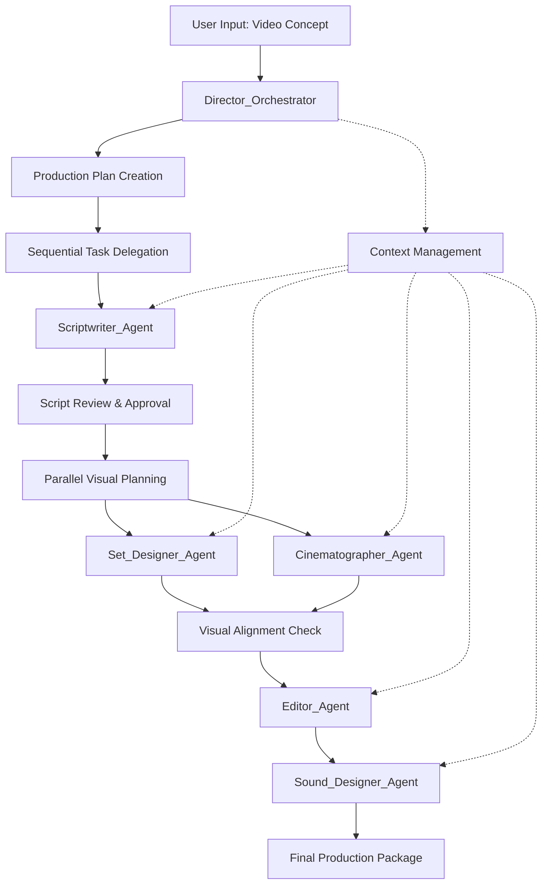

# Design Document: Agentic Video Production Studio

## Overview

The Agentic Video Production Studio is a sophisticated multi-agent AI system that orchestrates video production workflows using Google's Gemini 2.5 Flash model. The system employs a hierarchical orchestration pattern with a central Director_Orchestrator managing five specialized production agents: Scriptwriter, Set_Designer, Cinematographer, Editor, and Sound_Designer.

The architecture follows a sequential workflow pattern with parallel processing capabilities, where the Director_Orchestrator maintains creative vision consistency while delegating specialized tasks to domain-expert agents. Each agent leverages Gemini's structured output capabilities to produce standardized JSON documents that integrate seamlessly into a comprehensive production package.

## Architecture

### System Architecture Pattern

The system implements a **Coordinator Pattern** (also known as Manager-Worker Pattern) where:

- **Director_Orchestrator**: Central coordinator that receives user input, creates production plans, delegates tasks, mediates conflicts, and ensures workflow completion
- **Specialized Agents**: Domain-specific workers that execute assigned tasks and return structured outputs
- **Communication Layer**: Gemini API integration with structured JSON schema enforcement
- **State Management**: Conversation history and context preservation across production phases
- **Output Generation**: Structured document creation and packaging system



### Workflow Dependencies

The system enforces strict dependency management:

1. **Script Foundation**: All visual and audio work depends on approved script
2. **Visual Coordination**: Set design and cinematography must align before editing
3. **Edit Planning**: Requires completed visual specifications
4. **Audio Integration**: Final phase that incorporates all previous elements

## Components and Interfaces

### Director_Orchestrator Component

**Responsibilities:**
- Parse and analyze user video concepts
- Create structured production plans with phase definitions
- Delegate tasks to appropriate specialized agents
- Review agent outputs for quality and consistency
- Mediate conflicts between agent recommendations
- Maintain creative vision throughout production
- Generate final production packages

**Key Methods:**
- `analyzeConcept(userInput: string): ProductionPlan`
- `delegateTask(agent: AgentType, task: Task, context: ProductionContext): AgentOutput`
- `reviewOutput(agentOutput: AgentOutput, requirements: Requirements): ReviewResult`
- `mediateConflict(conflictingOutputs: AgentOutput[]): Resolution`
- `generateProductionPackage(allOutputs: AgentOutput[]): ProductionPackage`

### Specialized Agent Interface

All specialized agents implement a common interface:

```typescript
interface SpecializedAgent {
  agentType: AgentType;
  executeTask(task: Task, context: ProductionContext): Promise<AgentOutput>;
  validateOutput(output: AgentOutput): ValidationResult;
  reviseOutput(feedback: Feedback, previousOutput: AgentOutput): Promise<AgentOutput>;
}
```

### Scriptwriter_Agent Component

**Specialization:** Narrative structure, dialogue creation, scene development
**Output Schema:** Script with scene breakdowns, character assignments, timing estimates
**Key Capabilities:**
- Genre-appropriate writing styles
- Duration-based content structuring
- Character development and dialogue
- Scene transition planning

### Set_Designer_Agent Component

**Specialization:** Visual environments, aesthetic direction, scene composition
**Output Schema:** Visual direction with environment descriptions, color palettes, prop requirements
**Key Capabilities:**
- Environment conceptualization
- Aesthetic consistency maintenance
- Visual storytelling support
- Production feasibility consideration

### Cinematographer_Agent Component

**Specialization:** Camera work, lighting, shot composition, visual technical specifications
**Output Schema:** Shot list with camera angles, lighting setups, technical requirements
**Key Capabilities:**
- Shot composition planning
- Lighting design
- Camera movement specification
- Visual narrative enhancement

### Editor_Agent Component

**Specialization:** Pacing, transitions, sequence assembly, post-production planning
**Output Schema:** Edit plan with cut points, transition types, pacing specifications
**Key Capabilities:**
- Rhythm and pacing optimization
- Transition selection and timing
- Sequence flow planning
- Post-production workflow design

### Sound_Designer_Agent Component

**Specialization:** Audio direction, music selection, sound effects, audio mixing
**Output Schema:** Audio direction with music specifications, SFX requirements, mixing notes
**Key Capabilities:**
- Emotional audio mapping
- Music genre and tempo selection
- Sound effect categorization
- Audio-visual synchronization planning

## Data Models

### Core Data Structures

```typescript
interface ProductionConcept {
  description: string;
  duration?: number;
  genre?: string;
  targetAudience?: string;
  style?: string;
  format?: VideoFormat;
}

interface ProductionPlan {
  conceptSummary: string;
  phases: ProductionPhase[];
  dependencies: PhaseDependency[];
  timeline: PhaseTimeline[];
  creativeVision: CreativeVision;
}

interface ProductionPhase {
  phaseId: string;
  phaseName: string;
  assignedAgent: AgentType;
  dependencies: string[];
  deliverables: string[];
  estimatedDuration: number;
}

interface AgentOutput {
  agentType: AgentType;
  taskId: string;
  content: any; // Structured JSON specific to agent type
  metadata: OutputMetadata;
  timestamp: Date;
  version: number;
}

interface ProductionPackage {
  projectSummary: ProjectSummary;
  script: ScriptDocument;
  visualDirection: VisualDirectionDocument;
  shotList: ShotListDocument;
  editPlan: EditPlanDocument;
  audioDirection: AudioDirectionDocument;
  metadata: PackageMetadata;
}
```

### Agent-Specific Output Schemas

```typescript
interface ScriptDocument {
  title: string;
  genre: string;
  estimatedDuration: number;
  scenes: Scene[];
  characters: Character[];
  narrativeStructure: NarrativeStructure;
}

interface Scene {
  sceneId: string;
  sceneNumber: number;
  location: string;
  timeOfDay: string;
  duration: number;
  description: string;
  dialogue: DialogueLine[];
  action: ActionLine[];
  transitionIn: string;
  transitionOut: string;
}

interface VisualDirectionDocument {
  overallAesthetic: AestheticDirection;
  colorPalette: ColorPalette;
  environments: EnvironmentSpec[];
  visualThemes: VisualTheme[];
  productionNotes: ProductionNote[];
}

interface ShotListDocument {
  shots: Shot[];
  lightingSetups: LightingSetup[];
  cameraRequirements: CameraRequirement[];
  technicalNotes: TechnicalNote[];
}

interface EditPlanDocument {
  overallPacing: PacingStrategy;
  sequences: EditSequence[];
  transitions: TransitionSpec[];
  postProductionNotes: PostProductionNote[];
}

interface AudioDirectionDocument {
  musicDirection: MusicDirection;
  soundEffects: SoundEffectSpec[];
  audioMixing: AudioMixingSpec;
  synchronizationNotes: SyncNote[];
}
```

### Gemini API Integration Models

```typescript
interface GeminiRequest {
  model: "gemini-2.5-flash";
  contents: Content[];
  generationConfig: GenerationConfig;
}

interface GenerationConfig {
  responseMimeType: "application/json";
  responseJsonSchema: JSONSchema;
  temperature?: number;
  maxOutputTokens?: number;
}

interface Content {
  role: "user" | "model";
  parts: Part[];
}

interface Part {
  text: string;
}

interface AgentContext {
  productionConcept: ProductionConcept;
  previousOutputs: AgentOutput[];
  currentPhase: ProductionPhase;
  creativeVision: CreativeVision;
  conversationHistory: Content[];
}
```

## Correctness Properties

*A property is a characteristic or behavior that should hold true across all valid executions of a system—essentially, a formal statement about what the system should do. Properties serve as the bridge between human-readable specifications and machine-verifiable correctness guarantees.*

Based on the prework analysis, I've identified several categories of properties that need to be consolidated to eliminate redundancy:

**Property Reflection:**
- Multiple properties test JSON schema compliance across different agents - these can be consolidated into a single comprehensive schema validation property
- Several properties test workflow ordering and dependencies - these can be combined into workflow integrity properties  
- Cross-agent consistency properties can be unified into alignment verification properties
- Context and communication properties can be merged into context management properties

### Core System Properties

**Property 1: Video Concept Analysis Completeness**
*For any* video concept input, the Director_Orchestrator should extract and identify all present production requirements including genre, duration, style, target audience, and format specifications
**Validates: Requirements 1.1, 1.2, 1.3**

**Property 2: Production Plan Structure Integrity**
*For any* valid video concept, the Director_Orchestrator should generate a production plan containing all required phases (script, visual planning, editing, audio) with proper agent assignments and dependency relationships
**Validates: Requirements 1.5, 2.1**

**Property 3: Workflow Dependency Enforcement**
*For any* production workflow, no agent should receive task assignments before their prerequisite dependencies are completed, and the sequence should always follow: Script → Visual Planning (parallel) → Editing → Audio
**Validates: Requirements 2.1, 2.2, 2.3, 2.4, 2.5**

**Property 4: Agent Output Schema Compliance**
*For any* agent output, the generated content should be valid JSON that conforms to the agent's expected schema and contains all required fields for that agent type
**Validates: Requirements 3.3, 4.4, 6.5, 7.5**

**Property 5: Cross-Agent Content Alignment**
*For any* completed production, all agent outputs should be consistent with each other - visual elements should align with script content, edit plans should reference shot lists, and audio direction should match edit pacing
**Validates: Requirements 5.3, 5.5, 6.2, 7.4**

**Property 6: Context Preservation Across Phases**
*For any* multi-phase production, all agents should have access to relevant previous outputs and the full project context should be maintained throughout the workflow
**Validates: Requirements 8.2, 8.3, 8.4**

**Property 7: API Integration Consistency**
*For any* API interaction, the system should use the correct Gemini 2.5 Flash endpoint with proper authentication headers and structured output configuration
**Validates: Requirements 3.1, 3.2, 3.3**

**Property 8: Production Package Completeness**
*For any* completed production, the final package should contain all required documents (script, visual direction, shot list, edit plan, audio direction, summary) in both JSON and Markdown formats
**Validates: Requirements 9.1, 9.2, 9.3, 9.4**

**Property 9: Error Handling and Recovery**
*For any* error condition (API failures, invalid outputs, network issues), the system should handle the error gracefully, provide meaningful messages, and preserve work progress where possible
**Validates: Requirements 3.5, 11.1, 11.2, 11.3, 11.5**

**Property 10: Configuration Propagation**
*For any* user-specified preferences (duration, format, style, target audience), these constraints should be consistently reflected in all relevant agent outputs throughout the production
**Validates: Requirements 12.1, 12.2, 12.3**

## Error Handling

### API Error Management

The system implements comprehensive error handling for Gemini API interactions:

**Retry Strategy:**
- Exponential backoff with jitter for rate limiting (429 errors)
- Maximum 3 retry attempts for transient failures
- Circuit breaker pattern for sustained API unavailability
- Graceful degradation with cached responses when possible

**Error Classification:**
- **Transient Errors**: Network timeouts, rate limits, temporary service unavailability
- **Authentication Errors**: Invalid API keys, quota exceeded, permission denied
- **Validation Errors**: Invalid request format, schema violations, content policy violations
- **Critical Errors**: Service outages, malformed responses, unexpected exceptions

**Recovery Mechanisms:**
- Automatic retry for transient errors with exponential backoff
- User notification and manual intervention prompts for authentication issues
- Output validation and revision requests for malformed agent responses
- Workflow state preservation and resumption capabilities

### Agent Output Validation

**Schema Validation:**
- JSON schema validation for all agent outputs before workflow progression
- Required field verification and data type checking
- Content completeness validation (e.g., all scenes have required elements)
- Cross-reference validation (e.g., shot list references match script scenes)

**Quality Assurance:**
- Director_Orchestrator review of agent outputs for creative consistency
- Conflict detection between agent recommendations
- Automated revision requests with specific feedback
- Human intervention escalation for unresolvable conflicts

### State Management and Recovery

**Persistence Strategy:**
- Conversation history storage for context preservation
- Incremental progress saving at each workflow phase
- Agent output versioning for rollback capabilities
- User preference and configuration persistence

**Recovery Procedures:**
- Automatic workflow resumption from last successful checkpoint
- Manual intervention points for critical decision making
- Rollback capabilities to previous workflow states
- Export and import of production state for backup/restore

## Testing Strategy

### Dual Testing Approach

The system requires both unit testing and property-based testing for comprehensive coverage:

**Unit Tests:**
- Focus on specific examples, edge cases, and integration points
- Test individual agent behaviors with known inputs
- Validate API integration with mock responses
- Test error conditions and recovery scenarios
- Verify UI components and user interactions

**Property-Based Tests:**
- Verify universal properties across all inputs using randomized test data
- Test workflow integrity with generated video concepts
- Validate schema compliance across all agent types
- Test cross-agent consistency with varied production scenarios
- Verify context preservation across extended workflows

### Property-Based Testing Configuration

**Framework Selection:**
- **JavaScript/TypeScript**: fast-check library for comprehensive property testing
- **Python**: Hypothesis library for advanced property-based testing
- **Test Configuration**: Minimum 100 iterations per property test due to randomization
- **Tag Format**: Each test tagged with **Feature: agentic-video-production-studio, Property {number}: {property_text}**

**Test Data Generation:**
- Random video concept generation with varied genres, durations, and styles
- Synthetic agent output generation for cross-validation testing
- API response mocking for error condition simulation
- User preference randomization for configuration testing

**Coverage Requirements:**
- All correctness properties must be implemented as property-based tests
- Each property test must reference its corresponding design document property
- Unit tests complement property tests by covering specific examples and edge cases
- Integration tests verify end-to-end workflow execution with real API calls

### Testing Phases

**Development Testing:**
- Unit tests for individual components and functions
- Property tests for core business logic and workflow integrity
- Mock API testing for integration validation
- UI component testing for user interface functionality

**Integration Testing:**
- End-to-end workflow testing with real Gemini API calls
- Cross-agent communication and coordination testing
- Error handling and recovery scenario testing
- Performance testing under various load conditions

**Production Validation:**
- Smoke tests for critical workflow paths
- Monitoring and alerting for API failures and performance degradation
- User acceptance testing for production package quality
- Continuous property testing with production data patterns
```

Now I need to use the prework tool to analyze the acceptance criteria before writing the Correctness Properties section:

<function_calls>
<invoke name="prework">
<parameter name="featureName">agentic-video-production-studio